## macOS IDS - RODAN SENTINEL
 
An autonomous, zero maintenance macOS IDS built entirely with free and open source tools.  
One command. Four tools deployed. Silent protection 24/7.
 
```bash
curl -fsSL https://raw.githubusercontent.com/Rodan-elf/rodan-sentinel/main/setup.sh | bash
```
 
| Tool | Watches |
|---|---|
| LuLu | Every outbound network connection |
| BlockBlock | Every persistence attempt (LaunchAgents, login items) |
| OverSight | Camera & microphone activation |
| Malwarebytes | Malware, adware & ransomware |
 
→ **[View the project](https://github.com/Rodan-elf/rodan-sentinel)**
  
---

## Labs

Hands-on security exercises. Each lab documents an attack scenario, my methodology, and defensive countermeasures.

| Lab | Topic | Description |
|---|---|---|
| [lab-linux-backdoor-investigation](https://github.com/Rodan-elf/lab-linux-backdoor-investigation) | Incident Response | Compromised Linux system investigation > reverse shells, credential theft, cron persistence and login backdoors |
| [lab-Splunk-Custom-App](https://github.com/Rodan-elf/lab-Splunk-Custom-App) | SIEM / Log Management | Custom Splunk app built from scratch > data parsing, field extraction, and multi-sourcetype ingestion |
| [lab-MITRE-ATTCK-mapping](https://github.com/Rodan-elf/lab-MITRE-ATTCK-Mapping) | Threat Intelligence | ATT&CK Navigator mapping of Operation Cobalt Kitty > OceanLotus APT technique identification |
| [lab-home-network-hardening](https://github.com/Rodan-elf/lab-home-network-hardening) | Network Security | Real-world hardening of a home network > segmentation, credential hardening, WPA3 and firewall policy |
| [lab-baselining](https://github.com/Rodan-elf/lab-baselining) | Threat Detection | Osquery analysis across 50 workstations to identify anomalous artifacts |
| [lab-spear-phishing-campaign](https://github.com/Rodan-elf/lab-spear-phishing-campaign) | Social Engineering | Long-con reverse phishing campaign against a fictional e-commerce company |
| [lab-sql-incident-investigation](https://github.com/Rodan-elf/lab-sql-incident-investigation) | Threat Detection | SQL-based investigation of unauthorized login attempts |

---

## Reports

Structured security assessments following industry frameworks.

| Report | Framework | Description |
|---|---|---|
| [report-vulnerability-assessment](https://github.com/Rodan-elf/report-vulnerability-assessment) | NIST SP 800-30 | Vulnerability assessment of a public-facing database server |
| [report-ransomware-incident](https://github.com/Rodan-elf/report-ransomware-incident) | Incident Response | Ransomware attack analysis in a healthcare environment |

---

## Tools

Small scripts built while learning. Practical over polished.

| Tool | Language | Description |
|---|---|---|
| [tool-python-auth-filter](https://github.com/Rodan-elf/tool-python-auth-filter) | Python | Automates synchronization and removal of revoked IPs from an ACL |
| [tool-python-caesar-cipher](https://github.com/Rodan-elf/tool-python-caesar-cipher) | Python | Improved Caesar Cipher encryption/decryption tool |

---

## Notes

| Repo | Description |
|---|---|
| [notes-knowledge-base](https://github.com/Rodan-elf/notes-knowledge-base) | My digital garden (summaries, formulas and core principles from everything I'm studying) |

---

*Joined March 2026*
